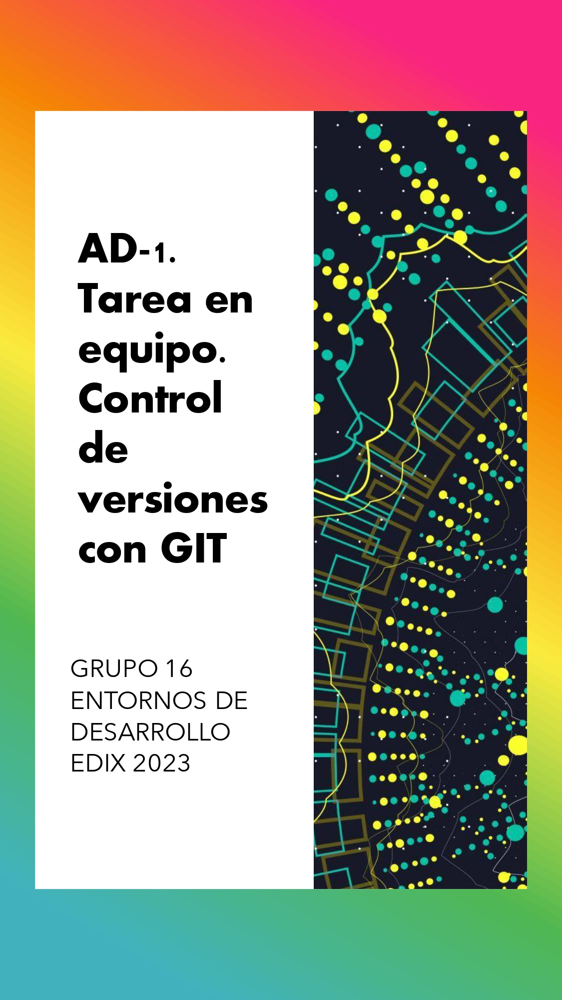
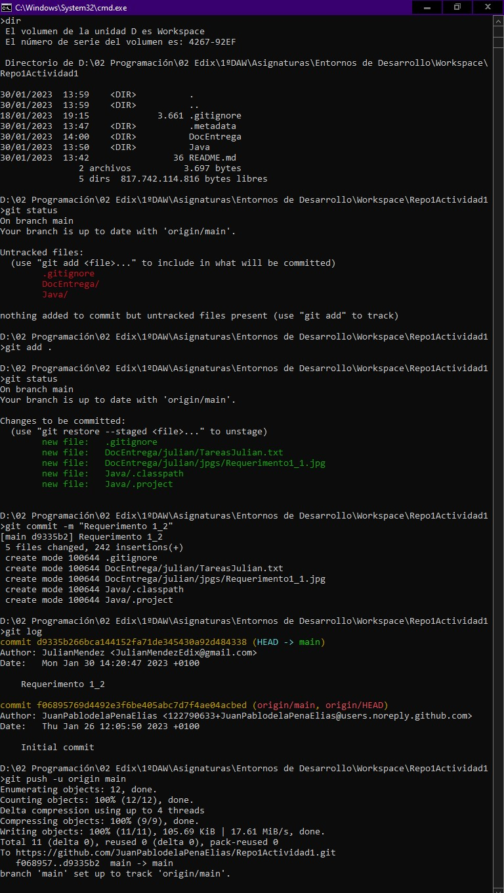
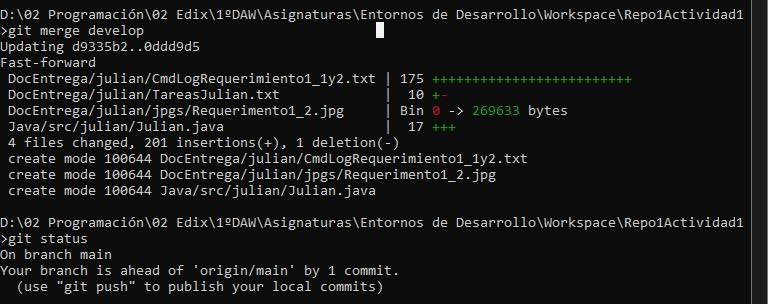
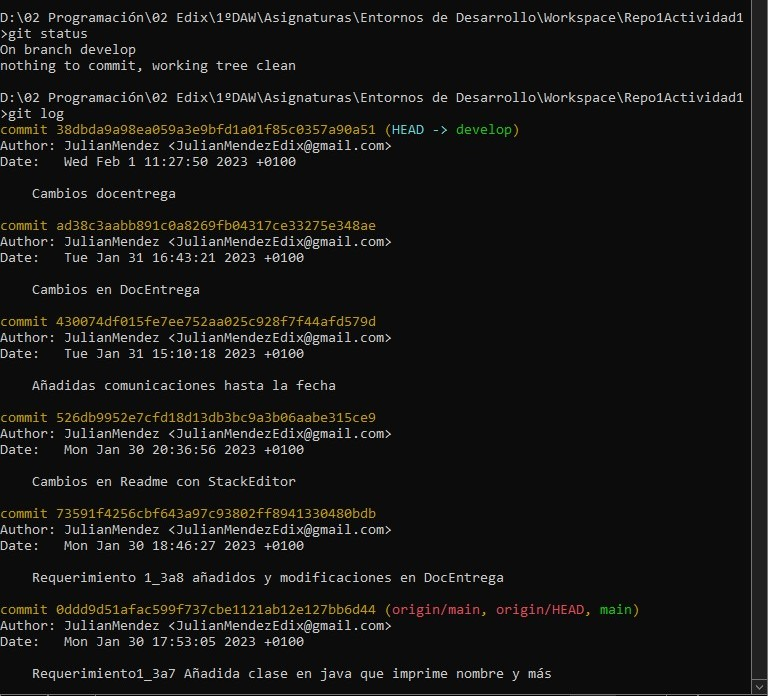
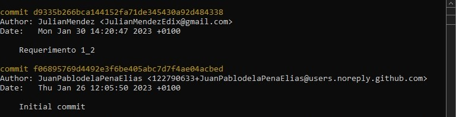
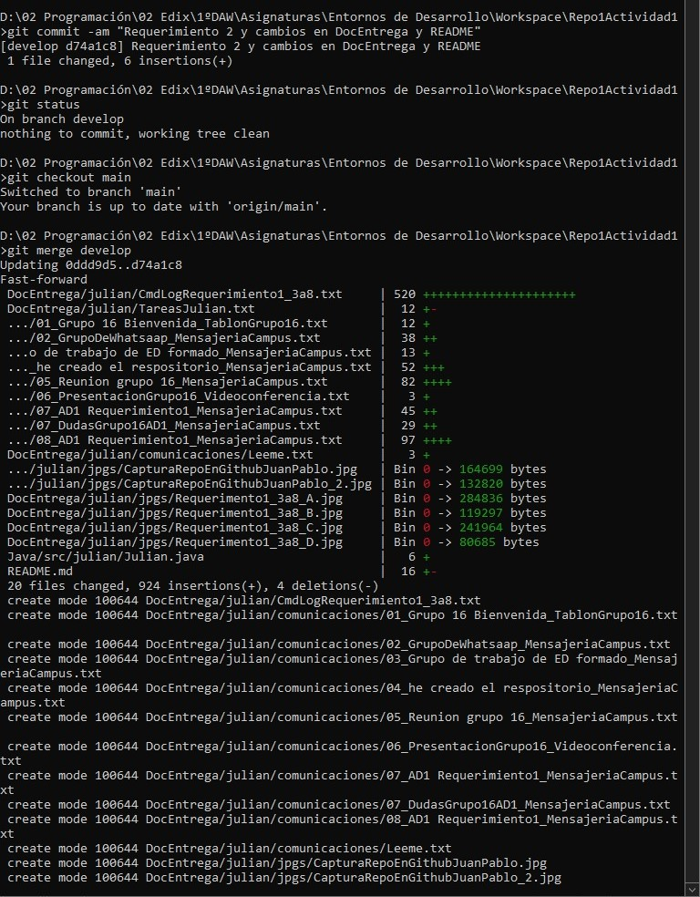


# ACTIVIDAD 1 

## Tarea en equipo. Control de versiones con GIT
Este es el documento formal requerido para la entrega de la actividad 1 de la asignatura "Entornos de Desarrollo" del primer curso del ciclo de Formación Profesional DAW en la escuela EDIX 2023.
# GRUPO 16
Este trabajo corresponde al Grupo 16, que está formado por:
 - Juan Pablo de la Peña Elías
 - Diego García Rodríguez
 - Alberto Ángel López Vilariño
 - Julián Méndez Podadera

El profesor  es Félix de Pablo.
# URL DEL REPOSITORIO

https://github.com/JuanPablodelaPenaElias/Repo1Actividad1.git

# REQUERIMIENTO 1
## Julián

 - Requerimiento 1 apartado 1:
 
Repositorio creado por Juan Pablo con Readme incluido el jueves 26 de enero.

Tenemos una reunión el lunes 30 de enero por la mañana en la que organizamos un poco las tareas y nos presentamos. Hablamos y me toca a mí hacer el punto 2 del requerimiento 1.

 - Requerimiento 1 apartado 2:

Inmediatamente después de la reunión clono el repositorio de Juan Pablo:

Abro eclipse y creo un 'workspace' en la carpeta del repositorio local recién clonado. En ese 'workspace' creo un proyecto normal de Java y lo titulo Java.
 
Copio y pego el archivo '.gitignore' (que es estándar para java y eclipse y nos viene muy bien) del repositorio  [WsGit](https://github.com/fdepablo/WsGit) de [Félix de Pablo](https://github.com/fdepablo) en 'github'.

Creo una carpeta en el repositorio local llamada 'DocEntrega', con el objetivo de que los miembros del grupo vayan volcando sus tareas y así ponerlas en común una vez realizadas.

A continuación me dedico a la parte específica de Git. Aquí, los pasos:

Compruebo en github y el 'push' ha ido bien, se ha creado el 'commit' [Requerimento 1_2](https://github.com/JuanPablodelaPenaElias/Repo1Actividad1/commit/d9335b266bca144152fa71de345430a92d484338) el lunes 30 de Enero al mediodía.

Con este paso todos podemos terminar el requerimiento 1.

- Requerimiento 1 apartado 3:

No me corresponde porque he hecho el 'push' con la última versión.

- Requerimiento 1 apartados 4 a 7:

Creo rama 'develop':

Me cambio a rama 'develop' y hago 'git log' para chequear que está todo ok:

Creo paquete y clase 'Julian' en eclipse y añado y modifico cosas en 'DocEntrega'.

Añado archivos al 'stage'.

Hago 'commit' en la rama 'develop'.
Chequeo con 'git log' y ok.

- Requerimiento 1 apartado 8.

Compruebo en 'github' que "llego el primero" y que no hay cambios en el remoto, así que hago el paso 8 y no el paso 9, tal y como indica la tarea.

Me paso a rama 'main'. 

Al cambiar me dice que la rama 'main' está actualizada con el remoto. También chequeo en GitHub que no hay cambios en el repositorio remoto de nuevo. Así que no hago 'pull' y hago 'merge' con la rama 'develop'.

Hago 'push' a las 17:53 el lunes 30 de enero

Chequeo y veo que en el remoto se ha creado el 'commit': [Requerimiento1_3a7 Añadida clase en java que imprime nombre y más](https://github.com/JuanPablodelaPenaElias/Repo1Actividad1/commit/0ddd9d51afac599f737cbe1121ab12e127bb6d44)

- Requerimiento 1 apartados 9 y 10.

No me corresponde directamente hacerlos. Estoy encima de mis compañeros desde el lunes 31 de Enero hasta el miércoles 1 de Febrero para que terminen su parte , y así ir todos juntos en el proceso y poder pasar al requerimiento 2. (véase carpeta "[comunicaciones](https://github.com/JuanPablodelaPenaElias/Repo1Actividad1/tree/main/DocEntrega/julian/comunicaciones)".

# REQUERIMIENTO 2
## Julián

Es miércoles por la tarde y han pasado dos días desde que todos podíamos completar el requerimiento 1. Así que, tras diferentes intentos de avance con los demás  (véase carpeta "[comunicaciones](https://github.com/JuanPablodelaPenaElias/Repo1Actividad1/tree/main/DocEntrega/julian/comunicaciones)"), y como me quedan dos días para terminar requerimientos 2 y 3 y documento de entrega, decido avanzar sólo y esperar a que se unan más tarde mis compañeros. Al fin y al cabo el requerimiento 2 no parece diferir gran cosa del requerimiento 1, es una edición sin conflicto, una repetición del proceso del requerimiento 1, o eso creo.

 - Requerimiento 2 apartado 1:

Me paso a rama "develop" y hago 'merge' con rama "main" (aunque no hace falta porque no hay cambios de mis compañeros).

 - Requerimiento 2 apartado 2:

Edito la clase java 'Julian' con eclipse para que imprima tres hobbies. Y hago otras modificaciones y añadidos para el documento de entrega. Hago varios 'commit' diferentes en mi rama develop.

 - Requerimiento 2 apartado 3:

Hago ulitmo commit. 
Cambio a rama 'main' y hago 'merge' de la rama "develop". Hago 'push' al repositorio remoto:

Me cambio a rama "develop".

- Requerimiento 2 apartados 4 y 5

No me corresponde hacerlos. Estoy pendiente de los compañeros, que todavía no han terminado el requisito 1 a día de hoy (miércoles 2 de enero). 

# REQUERIMIENTO 3
## Julián

Es jueves por la tarde y ha pasado un día desde que todos podíamos completar el requerimiento 2. No puedo avanzar porque es necesario que los compañeros lleguen aquí: el requerimiento 3 consiste en generar conflictos y soluciones con varios integrantes.

Así que, estoy encima de los demás compañeros y hablo con el profesor y pido una tutoría que nos concede el viernes por la mañana.  (Véase carpeta "[comunicaciones](https://github.com/JuanPablodelaPenaElias/Repo1Actividad1/tree/main/DocEntrega/julian/comunicaciones)").

# REQUERIMIENTO 4
## Conclusiones grupales

> Written with [StackEdit](https://stackedit.io/).

